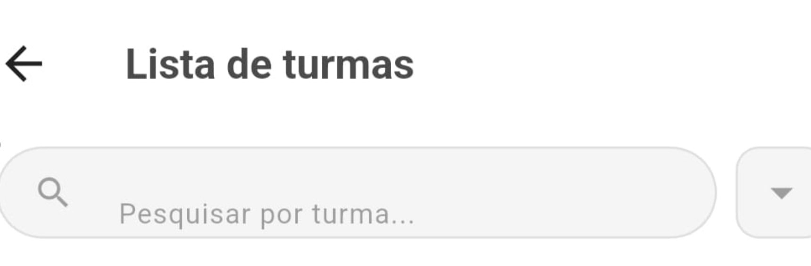
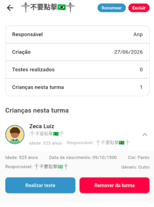

# Relatório de Testes - Aplicativo Mobile

## Testes de Navegação e Validação de Dados

---

## Resumo Executivo

| Métrica | Valor |
|---------|-------|
| Total de Bugs Encontrados | 4 |
| Críticos | 0 |
| Altos | 0 |
| Médios | 2 |
| Baixos | 2 |
| Data do Teste | 27/06/2026 |

---

## Tabela Resumo de Bugs

| ID | Arquivo de Evidência | Severidade | Categoria | Descrição |
|----|----------------------|------------|-----------|-----------|
| 001 | `evidencias/evidencia1.png` | Baixa | UI/Validação | Caracteres especiais e emojis aceitos no nome da turma |
| 002 | `evidencias/evidencia2.png` | Baixa | Validação | Emojis e caracteres especiais aceitos nos campos de criança e responsável |
| 003 | `evidencias/evidencia3.png` | Média | Validação de Dados | Data de nascimento aceita o ano 1500 |
| 004 | `evidencias/evidencia4.png` | Média | Validação de Dados | Data de nascimento aceita valor inválido 00/00/0000 |

---

## Relatórios Detalhados dos Bugs

### Bug #001 - Nome da Turma com Caracteres Especiais e Emojis

**Evidência:** `evidencias/evidencia1.png`

**Severidade:** Baixa (UI/Validação)

**Descrição:**
O campo de nome da turma aceita caracteres especiais, emojis e caracteres de outros idiomas (chinês: "不要點擊"), resultando em um título visualmente quebrado e pouco profissional.

**Imagem do Erro:**

**Passos para Reproduzir:**
1. Acessar a tela de criação/edição de turma
2. Inserir no campo nome: "不要點擊🎋👆"
3. Salvar a turma

**Resultado Esperado:** O sistema deve validar e rejeitar caracteres especiais/emojis nos nomes das turmas.

**Resultado Obtido:** O nome foi salvo e exibido com caracteres estranhos no cabeçalho da tela.

---

### Bug #002 - Dados da Criança com Emojis e Valores Inválidos

**Evidência:** `evidencias/evidencia2.png`

**Severidade:** Baixa (UI/Validação)

**Descrição:**
O sistema permite cadastrar uma criança com:
- Nome contendo emojis e caracteres chineses: "不要點擊🎋"
- Idade de 525 anos
- Campo "Responsável" também contendo emojis e caracteres especiais

**Imagem do Erro:**

**Passos para Reproduzir:**
1. Acessar a turma criada no Bug #001
2. Cadastrar uma criança com o nome "不要點擊🎋👆"
3. Preencher a data de nascimento com o ano 1500
4. Salvar

**Resultado Esperado:**
- Validação de nome (apenas letras)
- Limites de idade razoáveis
- Campo de responsável sem caracteres especiais

**Resultado Obtido:** Todos os dados foram aceitos e exibidos normalmente.

---

### Bug #003 - Data de Nascimento com Ano 1500

**Evidência:** `evidencias/evidencia3.png`

**Severidade:** Média (Validação de Dados)

**Descrição:**
O sistema permite cadastrar o usuário principal "Anp" com data de nascimento 09/10/1500, resultando em uma idade impossível (~525 anos).

**Imagem do Erro:**

**Passos para Reproduzir:**
1. Acessar o perfil do usuário
2. Editar a data de nascimento
3. Inserir "09/10/1500"
4. Salvar

**Resultado Esperado:** O sistema deve limitar o ano mínimo (ex: 1900) ou validar a idade máxima permitida.

**Resultado Obtido:** A data foi salva e exibida como "09/10/1500".

---

### Bug #004 - Data de Nascimento 00/00/0000

**Evidência:** `evidencias/evidencia4.png`

**Severidade:** Média (Validação de Dados)

**Descrição:**
Após editar o perfil do usuário "Anp", a data de nascimento foi alterada para 00/00/0000, um valor completamente inválido.

**Imagem do Erro:**

**Passos para Reproduzir:**
1. Acessar o perfil do usuário "Anp"
2. Clicar em "Editar"
3. Alterar a data de nascimento para "00/00/0000"
4. Salvar

**Resultado Esperado:** O sistema deve validar o formato da data e rejeitar valores nulos/zerados.

**Resultado Obtido:** A data "00/00/0000" foi salva e exibida no perfil.

---
